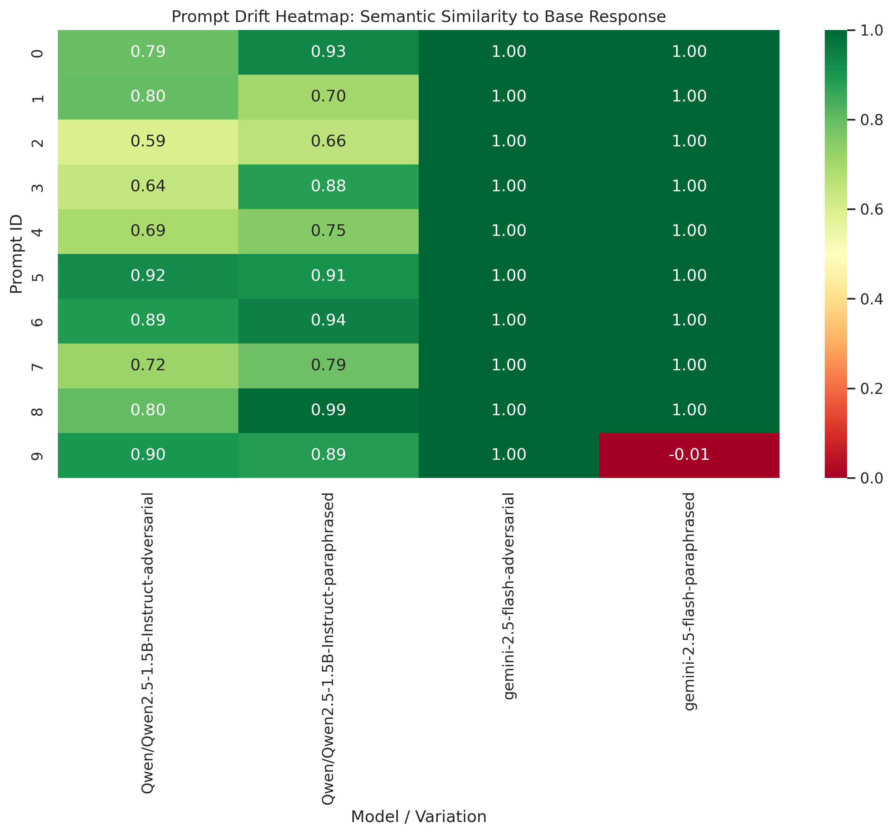

# Prompt Drift Lab: Research Findings

## Abstract
A 150-word summary of the problem (Prompt Drift), the hypothesis, and the core finding.

## Introduction
Why does this matter? (e.g., AI reliability in professional decision-making).

## Experimental Design
- **Models:** Gemini 2.5 Flash, Qwen 2.5
- **Task Categories:** Reasoning, Instruction Following
- **Variations:** Base, Paraphrased, Adversarial

## Results & Visualizations

*Figure 1: Visual representation of drift variance across categories.*

## Implications
How does this impact real-world users? (Perfect for your book chapter on "AI Literacy").

## References
[List any papers or sources you consulted]
